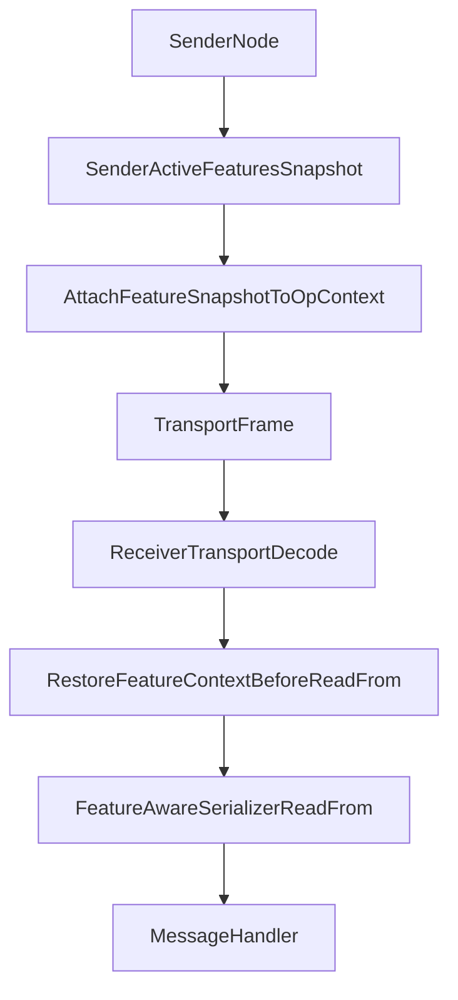

# Ignite Feature-aware Message Serialization and Deserialization

## Goal

Integrate Ignite Features into message serialization/deserialization so that the receiver parses each message according to the sender's active feature set (the feature set used when the message was created), not only the receiver's local feature state.

This must work for:
- Communication path (`GridIoMessage` over TCP communication SPI).
- Discovery path (`TcpDiscoveryAbstractMessage` over discovery TCP).

## Problem Statement

Current logic restores distributed operation context after transport deserialization has already completed. This is too late for feature-gated payload parsing.

Observed behavior:
- In communication flow, payload fields are deserialized in parser/serializer stage (`GridDirectParser` + generated serializers) before `GridIoManager` message processing starts.
- In discovery flow, `TcpDiscoveryIoSession.readMessage()` completes message deserialization before processing thread restores operation context.

As a result, we cannot safely implement feature-dependent field parsing in serializers based on sender state.

## Relevant Current Paths

### Communication
1. NIO server receives bytes.
2. `GridNioCodecFilter` calls `GridDirectParser.decode(...)`.
3. `GridDirectParser` resolves message type and invokes serializer `readFrom(...)`.
4. `GridIoMessage` and nested payload are deserialized.
5. Only later `GridIoManager` restores distributed attributes and invokes listeners.

### Discovery
1. `TcpDiscoveryIoSession.readMessage()` reads bytes from socket.
2. It creates message instance and loops through serializer `readFrom(...)` until finished.
3. Processing thread later restores operation context using `msg.opCtxMsg`.

## Design Principles

- Sender chooses parsing contract by attaching a stable feature snapshot to each message.
- Receiver restores sender feature context before payload deserialization.
- Feature-gated serializer read/write predicates must be deterministic and symmetric.
- Wire compatibility remains positional (no tagged field protocol introduced).
- Fallback behavior is conservative if feature context is absent.

## Proposed Architecture

### 1) Per-message Sender Feature Snapshot

Use distributed operation context as the transport envelope:
- Introduce a dedicated distributed attribute carrying sender feature snapshot.
- Snapshot includes component-aware feature sets already used by RU (`IgniteNodeFeatureSet` semantics).
- Sender captures snapshot once per message lifecycle and attaches it to outgoing context.

The snapshot must be stable for:
- Partial writes/retries.
- Nested message serialization.
- Compressed message/map serialization.

### 2) Pre-deserialization Context Restore Hooks

Add transport hooks that restore sender feature context before serializer `readFrom(...)`.

#### Communication hook
- In decode path before invoking message serializer.
- Apply for top-level message and nested reads.
- Ensure the same context is visible to generated serializers during all read states.

#### Discovery hook
- In `TcpDiscoveryIoSession.readMessage()` before serializer read loop.
- Scope covers full deserialization of one discovery message.
- Keep behavior consistent between server and client discovery implementations.

### 3) Serializer Feature-gating Contract

Replace version-based schema hints with feature-based hints:
- `@IntroducedBy(component, featureId)`
- `@DeprecatedBy(component, featureId)`

Generated serializer logic:
- Write/read field if introduced feature is active.
- Write/read field if deprecated feature is not active.
- If both annotations exist on one field, use conjunction:
  - active(introduced) AND not active(deprecated)

Critical invariant:
- Read and write predicates must be identical for a given feature context.

### 4) Reader/Writer Feature Query API

Extend message serialization API with minimal additions:
- `MessageReader#isFeatureSupported(component, featureId)`
- `MessageWriter#isFeatureSupported(component, featureId)`

Implementation details:
- Default methods return conservative value (`false`) for compatibility.
- `DirectMessageReader` and `DirectMessageWriter` resolve values from restored sender feature context.
- Temporary readers/writers used in compressed nested paths inherit same resolver.

### 5) State Machine Safety Rules

For generated state-machine serializers:
- `incrementState()` remains unconditional to preserve state progression.
- Guard controls only field read/write body.
- Gate evaluation must not depend on mutable ambient state mid-deserialization.
- Feature snapshot is fixed per message decode/encode scope.

## Data Flow

## Backward Compatibility Strategy

- Preserve existing message type IDs and positional ordering.
- Do not change old messages unless they require feature-gated fields.
- Conservative defaults for unknown context:
  - introduced fields are skipped.
  - deprecated fields remain active.
- Keep external/custom implementations source-compatible via default API methods.

## Rollout Plan

1. Add feature context attribute and lifecycle management.
2. Add pre-deserialization restore hooks in communication and discovery paths.
3. Add reader/writer feature query methods and direct implementations.
4. Add feature annotations and codegen support in `modules/codegen`.
5. Migrate selected RU-sensitive messages to feature annotations.
6. Gradually expand coverage across message types.

## Validation Plan

- Unit tests:
  - serializer generation for `@IntroducedBy` / `@DeprecatedBy`.
  - predicate symmetry and state progression.
- Integration tests:
  - communication and discovery between nodes with different active feature sets during RU finalization.
- Reliability tests:
  - partial read/write continuation.
  - nested message parsing.
  - compressed message and map paths.
- Negative tests:
  - absent or invalid sender feature context.
  - mismatch detection and error messaging for unsupported cases.

## Risks and Mitigations

- Risk: context changes during operation execution.
  - Mitigation: snapshot once per message and keep immutable for serializer scope.
- Risk: compressed nested deserialize uses temporary reader without context.
  - Mitigation: propagate same feature resolver into temporary reader/writer instances.
- Risk: divergence between discovery and communication behavior.
  - Mitigation: define unified transport contract and identical test matrix for both paths.

